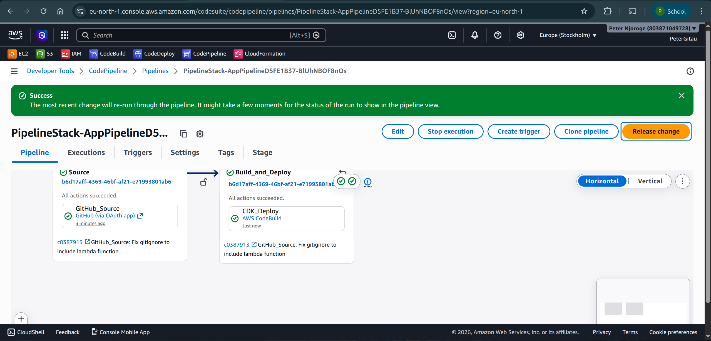
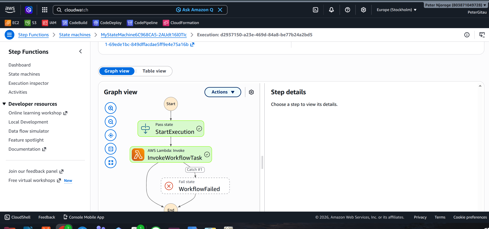
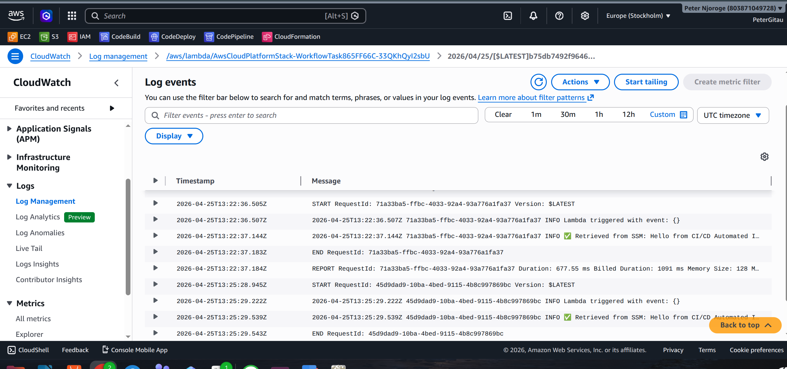

# AWS Multi-Account, Automated, and Governed Cloud Platform

## Project Overview
This project demonstrates how to build a robust, automated cloud platform using Infrastructure as Code (IaC) principles. The solution includes a CI/CD pipeline that deploys a serverless workflow using AWS Step Functions and AWS Lambda, with configuration management through AWS Systems Manager (SSM).

## Architecture
- **Infrastructure as Code**: AWS CDK (Cloud Development Kit) to declare all AWS resources
- **CI/CD Automation**: CodePipeline & CodeBuild automatically deploy infrastructure when code is updated
- **Workflow Orchestration**: AWS Step Functions execute a multi-step process with built-in error handling and retries
- **Compute & Config**: Lambda functions execute workflow tasks and retrieve configuration data from SSM Parameter Store

## Implementation Details

### Step Functions Workflow
The workflow consists of:
1. A Wait state that pauses for 5 seconds
2. A Task state that invokes a Lambda function
3. Error handling with retries (max 2 attempts)

### Lambda Function
The Lambda function:
- Retrieves a greeting message from SSM Parameter Store
- Logs the retrieved value
- Returns a success response with the greeting

### CI/CD Pipeline
The pipeline:
- Triggers on commits to the main branch of the GitHub repository
- Synthesizes the CDK app
- Deploys the infrastructure to AWS

## Screenshots

### CodePipeline Execution

### Step Functions Execution

### CloudWatch Logs

## How to Deploy
1. Clone this repository
2. Install dependencies: `npm install`
3. Bootstrap CDK: `cdk bootstrap`
4. Deploy the pipeline: `cdk deploy PipelineStack`

## Testing
After deployment:
1. Go to the Step Functions console
2. Start an execution of the state machine
3. Verify the execution completes successfully
4. Check CloudWatch Logs for the Lambda function output
